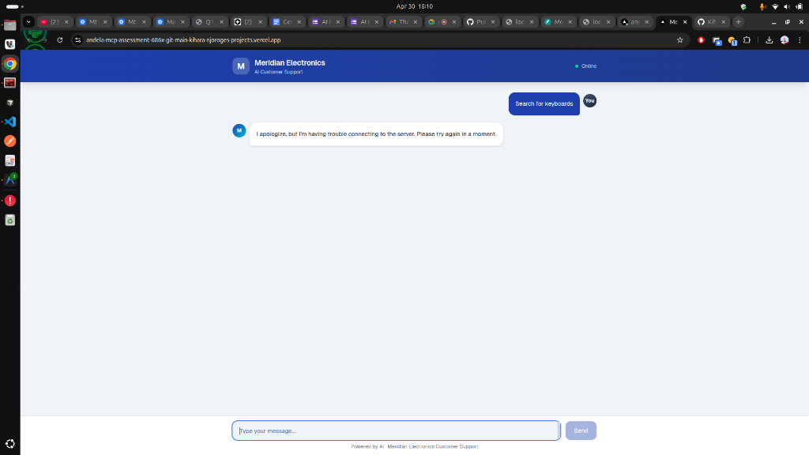

# Meridian Electronics — AI Customer Support

A full-stack, production-ready AI customer support chat application built for Meridian Electronics. The architecture is split between a Next.js frontend (Vercel) and a FastAPI Python backend (Render), communicating dynamically via OpenAI `gpt-4o-mini` and an external Order MCP server.



## Features

- **Split-Stack Architecture:** Next.js (React) frontend deployed on Vercel, isolated from the FastAPI Python backend on Render to avoid routing conflicts.
- **MCP Integration:** Dynamically fetches tools from the Meridian Order Model Context Protocol (MCP) server over Streamable HTTP.
- **Function Calling:** Powers product search, customer authentication, order placement, and history tracking directly via natural conversation using GPT-4o-mini.
- **Production Hardened:** 
  - Rate limiting (10 req/min/IP via `slowapi`)
  - Strict input validation via Pydantic (max message limits, whitelists, length caps)
  - Proper Markdown rendering with formatting and styling
  - Comprehensive 22-test automated suite (18 Pytest + 4 Jest)

## Quickstart (Local Development)

### Prerequisites
- Node.js 18+
- Python 3.12+
- An OpenAI API Key

### 1. Start the API
```bash
cd api
python3 -m venv venv
source venv/bin/activate
pip install -r requirements.txt

# Create a .env file inside /api
echo "OPENAI_API_KEY=your_key_here" > .env
echo "MCP_SERVER_URL=https://order-mcp-74afyau24q-uc.a.run.app/mcp" >> .env

# Run FastAPI
npm run dev:api  # or `uvicorn index:app --reload`
```
*(Runs on http://localhost:8000)*

### 2. Start the Frontend
In a new terminal window:
```bash
# In the root capstone directory
npm install
npm run dev
```
*(Runs on http://localhost:3000)*

## Testing

**Backend (Pytest):**
```bash
cd api && source venv/bin/activate && PYTHONPATH=. pytest tests/ -v
```

**Frontend (Jest):**
```bash
npm test
```

## Workflows

The AI agent gracefully handles the requested core sequences:
1. **Product Browsing:** Answers questions based on categories, retrieving live stock and pricing.
2. **Customer Authentication:** Securely verifies email and 4-digit PIN against the MCP system before allowing sensitive actions.
3. **Placing Orders:** Requires authentication. Confirms prices and logs orders via the backend.
4. **Order History:** Requires authentication. Looks up existing order status and history.
